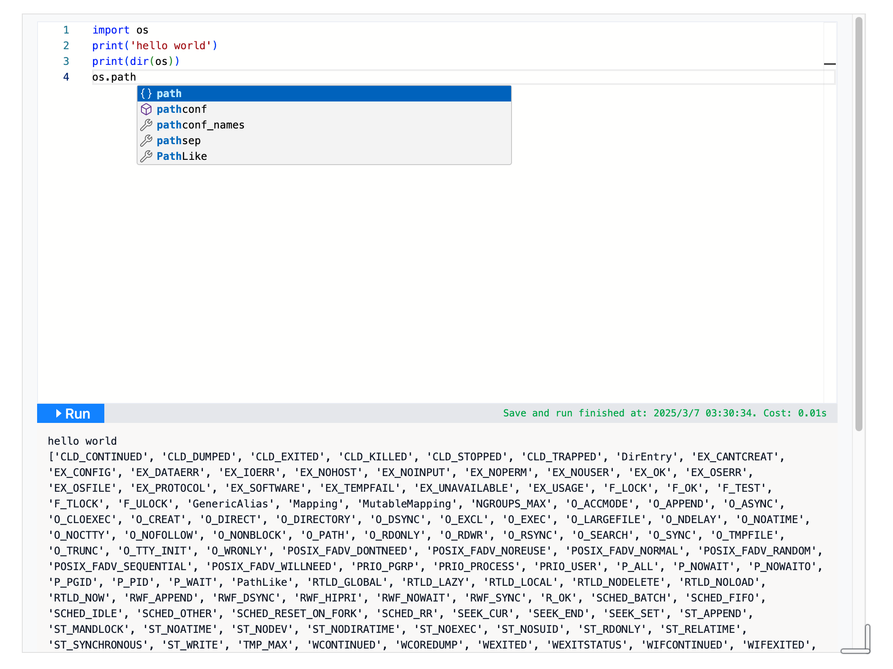

# run-python-code

这是一个可以在思源笔记里运行、保存 python 代码的挂件。它使用了 pyodide 库，可以直接在浏览器里运行 python 代码，可以安装纯 python 的第三方库。

目前支持的功能有：
* 运行、保存 python 代码
* 安装第三方库
* 借助 monaco editor 和 jedi 的能力，实现了代码自动补全

TODO：
- [x] 设置面板
- [ ] 代码格式化
- [ ] 主题切换
- [x] 在设置面板里进行第三方库安装
- [x] 支持保存 matplotlib 的输出结果 

## 使用说明

1. 使用挂件

2. 全局设置

3. matplotlib 图像支持

